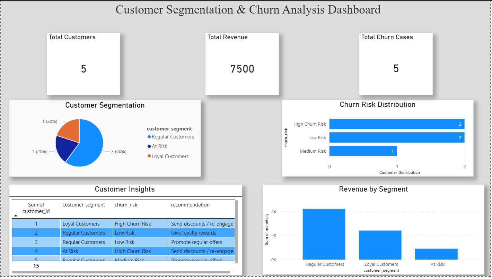

# 📊 RFM Customer Segmentation & Churn Analysis (SQL)

## 🔍 Overview
This project analyzes customer behavior using the RFM (Recency, Frequency, Monetary) model to segment customers and identify churn risk.

It helps businesses understand customer value and take data-driven decisions for retention and marketing strategies.

---

## 🛠️ Tools & Technologies
- SQL
- Excel (Dataset)

---

## 📈 Key Features
- RFM Score Calculation (Recency, Frequency, Monetary)
- Customer Segmentation (Champions, Loyal Customers, At Risk, Regular Customers)
- Churn Risk Analysis
- Business Recommendations for each segment

---

## 🧠 SQL Concepts Used
- Common Table Expressions (CTE)
- Window Functions (NTILE)
- Aggregations (SUM, COUNT)
- CASE Statements

---

## 📊 Insights
- Customers with high recency are at high churn risk
- Loyal customers contribute significantly to revenue
- Targeted offers can improve customer retention

---

## 📷 Output Preview

---

## 📁 Files Included
- `rfm_analysis.sql` – SQL queries
- `rfm_final_data.csv` – Dataset used
- `output.png` – Query output screenshot

---

## 🚀 Conclusion
This project demonstrates how SQL can be used to perform customer segmentation and derive actionable business insights.
